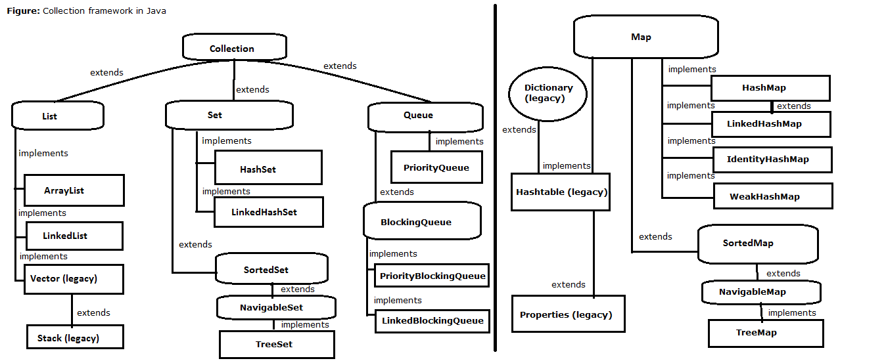

# Collection framework (java.util)

*Pre-requisite topics for Collections framework:-*
1.  AutoBoxing.
2. toString(. method.
3. type-casting.
4. interfaces.
5. for-each loop.
6. implementation classes.
7. compareTo(. method.
8. Wrapper classes.
9. Marker interfaces advantages.
10. Anonymous inner classes.

## Collection:
- A collection is a group of element/objects represented as single unit/entity
- On which programmers can perform various operations like insertion, deletion, sorting, searching, and reversing, etc.
- Collection is sometimes called a `container`. And it is object that groups multiple elements into a single unit.

## Why we need Collection framework ?
- In `Java 1.0` version, there are several classes to achieve above mentioned concepts, but they were all arranged in ad-hoc basis
- These classes are `Vector, Stack, Dictionary, Hashtable and Properties`. These classes collectively referred as `legacy classes` and every method inside legacy classes is synchronized (i.e.; Thread-safe access)

- With `Java 1.2` version introduction, Sun (now Oracle) group came up with Collection framework putting together above legacy classes and newly introduced classes into one place (i.e.; java.util package) under root-interface `java.util.Collection`

## What is Collection framework?

*   Collection framework contains group of classes and interfaces which are used for representing group of objects as a single entity.

 

## The key interfaces of collection framework:-
1. Java.util.Collection
2. Java.util.List
3. Java.util.Set
4. Java.util.SortedSet
5. Java.util.NavigablaSet
6. Java.util.Queue
7. Java.util.Map
8. Java.util.SotedMap
9. Java.util.NavigableMap
10. Map.Entry
11. Java.util.Enumeration
12. Java.util.Iterator
13. Java.util.ListIterator
14. Java.lang.Comparable
15. Java.util.Comparator

------------------------------------------------------------

## Root Interface --> public interface Collection<E> extends Iterable<E>
_Note :- The root interface of Collection framework is Collection and it contains 15 methods so all implementation classes are able to use that methods.They are as follows:_

	public abstract int size(); --> return the total number of elements in the collection.
	public abstract boolean isEmpty();
	public abstract boolean contains(java.lang.Object); -->  is used to search an element.
	public abstract java/util/Iterator<E> iterator(); -->returns an iterator.
	public abstract java.lang.Object[] toArray();
	public abstract <T extends java/lang/Object> T[] toArray(T[]);
	public abstract boolean add(E); -->  is used to insert an element in this collection.
	public abstract boolean remove(java.lang.Object); --> is used to delete an element from this collection.
	public abstract boolean containsAll(java/util/Collection<?>); -->is used to search the specified collection in this collection.
	public abstract boolean addAll(java/util/Collection<? extends E>); --> is used to insert the specified collection elements in the invoking collection.
	public abstract boolean removeAll(java/util/Collection<?>); -->  is used to delete all the elements of specified collection from the invoking collection.
	public abstract boolean retainAll(java/util/Collection<?>); --> is used to delete all the elements of invoking collection except the specified collection.
	public abstract void clear(); --> removes the total no of element from the collection.
	public abstract boolean equals(java.lang.Object);
	public abstract int hashCode();
------------------------------------------------------------

## Iterator interface
-	Iterator interface provides the facility of iterating the elements in forward direction only.
-	There are only three methods in the Iterator interface. They are:

	public boolean hasNext() it returns true if iterator has more elements.
	public object next() it returns the element and moves the cursor pointer to the next element.
	public void remove() it removes the last elements returned by the iterator. It is rarely used.

### Collection vs Collections:-

*   **Collection**  is interface it is used to _represent group of objects as a single entity_.
*   **Collections**  is _utility class_  it contains methods to perform operations.

### Characteristics of Collection frame work classes:-

1. The collect ion framework classes are introduced in different Versions.
2. Heterogeneous data allowed or not allowed. All classes allowed heterogeneous data except two classes
i. TreeSet ii. TreeMap
3. Null insertion is possible or not possible.
4. Insertion order is preserved or not preserved.
	`Input --->e1 e2 e3 output --->e1 e2 e3 insertion order is preserved` 
	`Input --->e1 e2 e3 output --->e2 e1 e3 insertion order is not-preserved`	

5. Collection classes methods are synchronized or non-synchronized.
6. Duplicate objects are allowed or not allowed.
7. Collections classes supports cursors.

#### Legacy class:- 
* The java classes which are introduced in 1.0 version are called legacy classes.
	
	Ex :- Vector , Stack , HashTable…….etc

## Reference Links
1. [collection-framework-in-java](https://www.benchresources.net/collection-framework-in-java/ "benchresources") 

